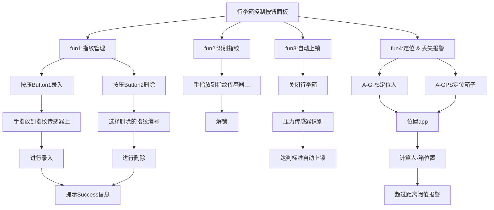

    

         
        
    

         
    

        
	

		   
    《智能拉杆箱》
    
作业

     
     
    <table style="border:none;text-align:center;width:72%;font-family:仿宋;font-size:14px; margin: 0 auto;">
    <tbody style="font-family:方正公文仿宋;font-size:12pt;">
    	<tr style="font-weight:normal;"> 
    		<td style="width:20%;text-align:right;">题　　目</td>
    		<td style="width:2%">：</td> 
    		<td style="width:40%;font-weight:normal;border-bottom: 1px solid;text-align:center;font-family:华文仿宋">物联网作业3</td>     </tr>
    	<tr style="font-weight:normal;"> 
    		<td style="width:20%;text-align:right;">授课教师</td>
    		<td style="width:2%">：</td> 
    		<td style="width:40%;font-weight:normal;border-bottom: 1px solid;text-align:center;font-family:华文仿宋"></td>     </tr>
    	<tr style="font-weight:normal;"> 
    		<td style="width:20%;text-align:right;">姓　　名</td>
    		<td style="width:2%">：</td> 
    		<td style="width:40%;font-weight:normal;border-bottom: 1px solid;text-align:center;font-family:华文仿宋"> </td>     </tr>
        <tr style="font-weight:normal;"> 
    		<td style="width:20%;text-align:right;">班　　级</td>
    		<td style="width:2%">：</td> 
    		<td style="width:40%;font-weight:normal;border-bottom: 1px solid;text-align:center;font-family:华文仿宋"> </td>     </tr>
    	<tr style="font-weight:normal;"> 
    		<td style="width:20%;text-align:right;">学　　号</td>
    		<td style="width:2%">：</td> 
    		<td style="width:40%;font-weight:normal;border-bottom: 1px solid;text-align:center;font-family:华文仿宋"> </td>     </tr>
    	<tr style="font-weight:normal;"> 
    		<td style="width:20%;text-align:right;">日　　期</td>
    		<td style="width:2%">：</td> 
    		<td style="width:40%;font-weight:normal;border-bottom: 1px solid;text-align:center;font-family:华文仿宋">2022-6-23</td>     </tr>
    </tbody>              
    </table>

<!-- 注释语句：导出PDF时会在这里分页 -->

## 任务目标

设计一套带有定位、指纹识别、自动上锁、丢失报警功能的智能拉杆箱，说明设计思路、采用技术和控制流程图

## 设计思路

定位：增加定位模块，利用定位技术实现定位。A-GPS识别到位置之后，发送信息数据到移动设备上。使用者可以实时使用app查看自己和行李箱的位置。

指纹识别：通过指纹传感器进行指纹信息的采集和识别，以指纹解锁的方式提高行李箱的安全性能。当识别指纹正确后，行李箱自动解锁。

自动上锁：通过压力传感器，识别到行李箱盖子关闭之后，自动上锁。

丢失报警：以定位技术为前提，识别到行李箱距离用户超过预定的距离值后，自动产生报警信号，用以提高行李箱的安全性能。

## 采用技术

定位：A-GPS辅助GPS定位技术

指纹解锁：指纹传感器

自动上锁：压力传感器

丢失报警：A-GPS辅助GPS定位技术+测距报警

A-GPS（Assisted GPS）即辅助GPS技术，它可以提高 GPS 卫星定位系统的性能。通过移动通信运营基站它可以快速地定位，广泛用于含有GPS功能的手机上。GPS通过卫星发出的无线电信号来进行定位。

## 控制流程图

