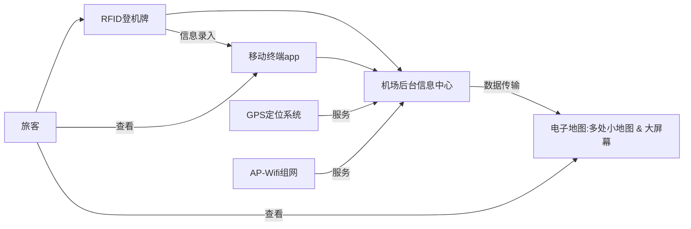

    

         
        
    

         
    

        
	

		   
    《RFID机场乘客定位系统》
    
作业

     
     
    <table style="border:none;text-align:center;width:72%;font-family:仿宋;font-size:14px; margin: 0 auto;">
    <tbody style="font-family:方正公文仿宋;font-size:12pt;">
    	<tr style="font-weight:normal;"> 
    		<td style="width:20%;text-align:right;">题　　目</td>
    		<td style="width:2%">：</td> 
    		<td style="width:40%;font-weight:normal;border-bottom: 1px solid;text-align:center;font-family:华文仿宋">物联网作业4</td>     </tr>
    	<tr style="font-weight:normal;"> 
    		<td style="width:20%;text-align:right;">授课教师</td>
    		<td style="width:2%">：</td> 
    		<td style="width:40%;font-weight:normal;border-bottom: 1px solid;text-align:center;font-family:华文仿宋">吴鹏飞</td>     </tr>
    	<tr style="font-weight:normal;"> 
    		<td style="width:20%;text-align:right;">姓　　名</td>
    		<td style="width:2%">：</td> 
    		<td style="width:40%;font-weight:normal;border-bottom: 1px solid;text-align:center;font-family:华文仿宋"> 朱焰星</td>     </tr>
        <tr style="font-weight:normal;"> 
    		<td style="width:20%;text-align:right;">班　　级</td>
    		<td style="width:2%">：</td> 
    		<td style="width:40%;font-weight:normal;border-bottom: 1px solid;text-align:center;font-family:华文仿宋"> 计科1901</td>     </tr>
    	<tr style="font-weight:normal;"> 
    		<td style="width:20%;text-align:right;">学　　号</td>
    		<td style="width:2%">：</td> 
    		<td style="width:40%;font-weight:normal;border-bottom: 1px solid;text-align:center;font-family:华文仿宋">2019317220115 </td>     </tr>
    	<tr style="font-weight:normal;"> 
    		<td style="width:20%;text-align:right;">日　　期</td>
    		<td style="width:2%">：</td> 
    		<td style="width:40%;font-weight:normal;border-bottom: 1px solid;text-align:center;font-family:华文仿宋">2022-6-23</td>     </tr>
    </tbody>              
    </table>

<!-- 注释语句：导出PDF时会在这里分页 -->

## 任务目标

设计一套用RFID定位机场候机乘客的系统，说明设计思路、采用的定位技术与位置服务方法和原理和控制流程图。

## 设计思路

### RFID技术

利用RFID定位乘客，则需要每个乘客拥有一个独一无二的身份识别码。所以将机票中融合RFID技术，用于追踪的RFID标签将被贴加在登机牌上，使得携带自己机票的乘客随身携带一个独一无二的RFID识别码。

### 定位技术

在机场的各个位置，如候机室，公共厕所，餐饮厅、购物店、安检口等处，部署定位AP，组建WIFI实时定位系统。

Wi-Fi定位技术是室内定位技术中的一种，指通过无线接入点（包括无线路由器）组成的无线局域网络（WLAN），可以实现复杂环境中的定位、监测和追踪任务。它以网络节点（无线接入点）的位置信息为基础和前提，采用经验测试和信号传播模型相结合的方式，对已接入的移动设备进行位置定位，最高精确度大约在1米至20米之间。如果定位测算仅基于当前连接的Wi-Fi接入点，而不是参照周边Wi-Fi的信号强度合成图，则Wi-Fi定位就很容易存在误差（例如：定位楼层错误）。另外，Wi-Fi接入点通常都只能覆盖半径90米左右的区域，而且很容易受到其他信号的干扰，从而影响其精度，定位器的能耗也较高。

1. 每一个无线AP都有一个全球唯一的MAC地址，并且一般来说无线AP在一段时间内是不会移动的
2. 设备在开启Wi-Fi的情况下，即可扫描并收集周围的AP信号，无论是否加密，是否已连接，甚至信号强度不足以显示在无线信号列表中，都可以获取到AP广播出来的MAC地址
3. 设备将这些能够标示AP的数据发送到位置服务器，服务器检索出每一个AP的地理位置，并结合每个信号的强弱程度，计算出设备的地理位置并返回到用户设备
4. 位置服务商要不断更新、补充自己的数据库，以保证数据的准确性，毕竟无线AP不像基站塔那样基本100%不会移动

### 位置服务方法

1. 使用机场电子地图，在机场显眼位置大屏幕显示让旅客知道整体机场架构，并在多处布置小型电子地图，使得旅客可以看到自身实时所处的位置，避免传统地图难以辨认的麻烦。并且服务人员也可以快速查找到某位旅客的具体位置信息
2. 和机场的高清摄像头结合，使得摄像头能够快速定位未登机或需要帮助的乘客信息，令服务人员快速前去引导帮助
3. 采用移动端app，让旅客下载。其中可以显示自己的位置，可以选择路径导航。

对于不同角色来说：

- 旅客定位
  1. 定位AP组建Wifi实时定位系统
  2. Wifi AP通信
  3. AP定位器间用网线连接组网
- 机场位置服务
  1. 机场电子地图
  2. 服务设施引导
  3. 有求助键，服务人员及时赶到帮忙
  4. 不同设施处引导人员引导
- 信息服务
  1. 机场重要信息通过广播、电子屏幕推送
  2. 旅客主动查询信息

## 控制流程图

