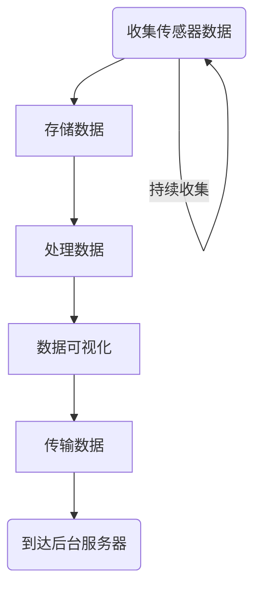

    

         
        
    

         
    

        
	

		   
    《车载城市环境监控系统》
    
作业

     
     
    <table style="border:none;text-align:center;width:72%;font-family:仿宋;font-size:14px; margin: 0 auto;">
    <tbody style="font-family:方正公文仿宋;font-size:12pt;">
    	<tr style="font-weight:normal;"> 
    		<td style="width:20%;text-align:right;">题　　目</td>
    		<td style="width:2%">：</td> 
    		<td style="width:40%;font-weight:normal;border-bottom: 1px solid;text-align:center;font-family:华文仿宋">物联网作业5</td>     </tr>
    	<tr style="font-weight:normal;"> 
    		<td style="width:20%;text-align:right;">授课教师</td>
    		<td style="width:2%">：</td> 
    		<td style="width:40%;font-weight:normal;border-bottom: 1px solid;text-align:center;font-family:华文仿宋">吴鹏飞</td>     </tr>
    	<tr style="font-weight:normal;"> 
    		<td style="width:20%;text-align:right;">姓　　名</td>
    		<td style="width:2%">：</td> 
    		<td style="width:40%;font-weight:normal;border-bottom: 1px solid;text-align:center;font-family:华文仿宋"> 朱焰星</td>     </tr>
        <tr style="font-weight:normal;"> 
    		<td style="width:20%;text-align:right;">班　　级</td>
    		<td style="width:2%">：</td> 
    		<td style="width:40%;font-weight:normal;border-bottom: 1px solid;text-align:center;font-family:华文仿宋"> 计科1901</td>     </tr>
    	<tr style="font-weight:normal;"> 
    		<td style="width:20%;text-align:right;">学　　号</td>
    		<td style="width:2%">：</td> 
    		<td style="width:40%;font-weight:normal;border-bottom: 1px solid;text-align:center;font-family:华文仿宋">2019317220115 </td>     </tr>
    	<tr style="font-weight:normal;"> 
    		<td style="width:20%;text-align:right;">日　　期</td>
    		<td style="width:2%">：</td> 
    		<td style="width:40%;font-weight:normal;border-bottom: 1px solid;text-align:center;font-family:华文仿宋">2022-6-23</td>     </tr>
    </tbody>              
    </table>

<!-- 注释语句：导出PDF时会在这里分页 -->

## 任务目标

设计一套利用公交车实时、移动采集城市温度、湿度、氧气和二氧化碳浓度、噪声、污染物等参数的环境监测系统，给出系统设计思想、系统架构和控制流程图。

## 设计思想

在车的外部设置多种传感器，检测各种环境参数

将各种参数传递给车内的服务器上，进行数据存储、处理、可视化等操作

将数据传输到管理中心，便于管理员查看，并备份留给后续使用。同时可以根据信息制定后续措施与条例、与其他部门对接等。

## 系统架构

## 控制流程图

