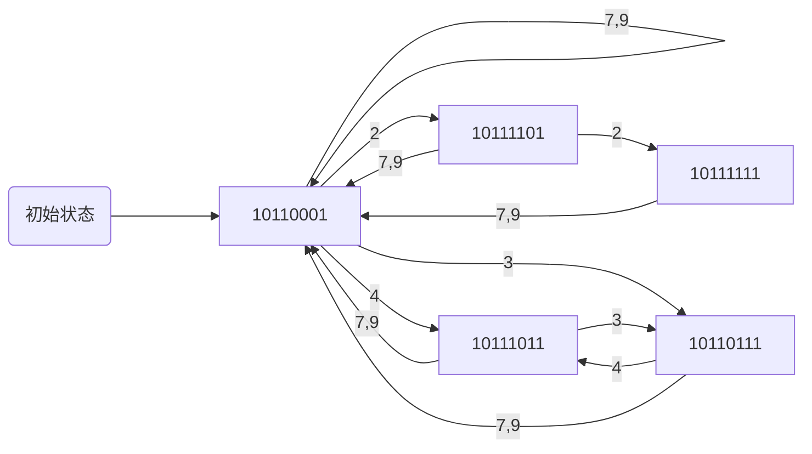

# 体系结构作业


1. 软件兼容的例子

目前64位的操作系统，可以运行之前32位的程序。
例如office更新后，pptx，docx是新版本文件后缀，但是仍然能打开旧版本doc，ppt等后缀的文件

2. 某非线性流水的预约表如下所示
   

禁止表：{1, 5, 6, 8}

- S1: 9 - 1 = 8
- S2: 3 - 2 = 1， 8 - 2 = 6， 8 - 3 = 5
- S3: 0
- S4: 6 - 5 = 1
- S5: 8 - 7 = 1

冲突向量：10110001

状态转移图：



平均间隔拍数：

| 调度方案 | 平均间隔拍数 | 调度方案 | 平均间隔拍数 |
| -------- | ------------ | -------- | ------------ |
| 2, 2, 7  | 3.67         | 3, 7     | 5            |
| 2, 7     | 4.5          | 4, 3, 7  | 4.67         |
| 3, 4     | 3.5          | 4, 7     | 5.5          |
| 4, 3     | 3.5          | 7        | 7            |
| 3, 4, 7  | 4.67         |          |              |


3. 有一条指令流水线由4段组成，其中每当流经第3段时，总要在该段循环一次，然后才能流到第4段。如果年段经过一次所需要的时间都是△t，问：

   1. 当流水线的输入端连续地每隔时向△t输入任务时，会发生什么情况？

      ```mermaid
      graph LR;
      S1 ---> S2 ---> S3 ---> S4
      S3 ---> S3
      ```

      ```mermaid
      graph LR;
      S1 ---> S2 ---> S3 ---> S4
      ```

      因为S3段占用两个 $\Delta t$ , 所以两个任务将会冲突

   2. 此流水线的最大吞吐率为多少？如果每隔2△t输入一个任务，连续输入10个任务的实际吞吐率和效率

      流水线中最慢一段所需的时间为2△t，故最大吞吐率为 $\frac{1}{2△t}$

      连续输入10个任务，所需总时间为 $5△t+(10-1)*2△t=23△t$ ，故实际吞吐为 $\frac{10}{23△t}$

      效率为 $10*5△t/(4*23△t)=50/92=54.4\% $

   3. 当每段时间不变时，如何提高该流水线的吞吐率？仍连续处理10个任务时，吞吐率提高多少？

      瓶颈段细分：
      ```mermaid
      graph LR;
      S1 ---> S2 ---> S3-1 ---> S3-2 ---> S4
      ```

      瓶颈段重复：

      ```mermaid
      graph LR;
      S1 ---> S2 ---> S3-1 ---> S4
      S2  ---> S3-2 ---> S4
      ```

      提高后的吞吐效率为 $\dfrac{10}{5△t+(10-1)△t}=\dfrac{10}{14△t}=\dfrac{5}{7△t}$ ，提高了 $1-\dfrac{\frac{5}{7}}{\frac{10}{23}}=64\%$


4. 对于一个容量为3个块的全相联Cache，假定访问的地址块号序列为1，2，3，4，1，2，3，4，分别用FIFO算法和LRU算法，写出其队列变化情况，并得出结论.

​	FIFO：

| 时间 | 访问 | 块1  | 块2  | 块3  |
| ---- | ---- | ---- | ---- | ---- |
| 1    | 1    | 1    |      |      |
| 2    | 2    | 1    | 2    |      |
| 3    | 3    | 1    | 2    | 3    |
| 4    | 4    | 4    | 2    | 3    |
| 5    | 1    | 4    | 1    | 3    |
| 6    | 2    | 4    | 1    | 2    |
| 7    | 3    | 3    | 1    | 2    |
| 8    | 4    | 3    | 4    | 2    |

LRU：

| 时间 | 访问 | 块1  | 块2  | 块3  |
| ---- | ---- | ---- | ---- | ---- |
| 1    | 1    | 1    |      |      |
| 2    | 2    | 1    | 2    |      |
| 3    | 3    | 1    | 2    | 3    |
| 4    | 4    | 4    | 2    | 3    |
| 5    | 1    | 4    | 1    | 3    |
| 6    | 2    | 4    | 1    | 2    |
| 7    | 3    | 3    | 1    | 2    |
| 8    | 4    | 3    | 4    | 2    |

命中率受地质块流访问的影响