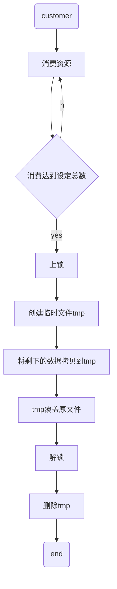

<div class="cover" style="page-break-after:always;font-family:方正公文仿宋;width:100%;height:100%;border:none;margin: 0 auto;text-align:center;">
    <div style="width:60%;margin: 0 auto;height:0;padding-bottom:10%;">
        </br>
        
    </div>
    </br></br></br></br></br>
    <div style="width:60%;margin: 0 auto;height:0;padding-bottom:40%;">
        
	</div>
		</br></br></br>
    <span style="font-family:华文黑体Bold;text-align:center;font-size:20pt;margin: 10pt auto;line-height:30pt;">《文件I/O程序设计》</span>
    <p style="text-align:center;font-size:14pt;margin: 0 auto">实验报告 </p>
    </br>
    </br>
    <table style="border:none;text-align:center;width:72%;font-family:仿宋;font-size:14px; margin: 0 auto;">
    <tbody style="font-family:方正公文仿宋;font-size:12pt;">
    	<tr style="font-weight:normal;"> 
    		<td style="width:20%;text-align:right;">题　　目</td>
    		<td style="width:2%">：</td> 
    		<td style="width:40%;font-weight:normal;border-bottom: 1px solid;text-align:center;font-family:华文仿宋"> Linux第二次实验报告</td>     </tr>
    	<tr style="font-weight:normal;"> 
    		<td style="width:20%;text-align:right;">授课教师</td>
    		<td style="width:2%">：</td> 
    		<td style="width:40%;font-weight:normal;border-bottom: 1px solid;text-align:center;font-family:华文仿宋"></td>     </tr>
    	<tr style="font-weight:normal;"> 
    		<td style="width:20%;text-align:right;">姓　　名</td>
    		<td style="width:2%">：</td> 
    		<td style="width:40%;font-weight:normal;border-bottom: 1px solid;text-align:center;font-family:华文仿宋"> </td>     </tr>
        <tr style="font-weight:normal;"> 
    		<td style="width:20%;text-align:right;">班　　级</td>
    		<td style="width:2%">：</td> 
    		<td style="width:40%;font-weight:normal;border-bottom: 1px solid;text-align:center;font-family:华文仿宋"> </td>     </tr>
    	<tr style="font-weight:normal;"> 
    		<td style="width:20%;text-align:right;">学　　号</td>
    		<td style="width:2%">：</td> 
    		<td style="width:40%;font-weight:normal;border-bottom: 1px solid;text-align:center;font-family:华文仿宋"> </td>     </tr>
    	<tr style="font-weight:normal;"> 
    		<td style="width:20%;text-align:right;">日　　期</td>
    		<td style="width:2%">：</td> 
    		<td style="width:40%;font-weight:normal;border-bottom: 1px solid;text-align:center;font-family:华文仿宋">2022-6-20</td>     </tr>
    </tbody>              
    </table>
</div>


<!-- 注释语句：导出PDF时会在这里分页 -->

# Linux实验报告

## 实验目的 

基于Linux中文件I/O相关的应用开发，掌握有关文件操作函数的使用方法，并掌握生产者与消费者模式的程序开发。

## 实验内容

（1）先启动生产者进程，它负责创建模拟FIFO结构的文件（其实是一个普通文件，不能使用FIFO文件）并投入生产，向文件写入自动生成的字符，字符内容自定义。 

（2）后启动的消费者进程按照给定的数目进行消费。首先从文件中读取相应的数目的字符并在屏幕上显示，然后从文件中删除刚才消费过的数据。为了模拟FIFO结构，此时需要使用两次复制来实现文件内容的前移。 

（3）解决涉及的同步与互斥问题

## 实验步骤

### 基础概念

文件IO的概念：文件IO指的就是文件的输入输出。这里的输入输出是从内存的角度出发的，也就是说，输入就是从文件读取数据输入到内存中，输出就是从内存中读取数据输出到文件中。

文件描述符（file descriptor）：系统通过文件描述符(一个非负的整型值)将各种IO类型统一起来。这些IO类型包括普通文件，终端，管道，FIFO，设备，套接字等等。有了文件描述符，就可以使用一套统一的IO函数：open/read/write/close等

生产者消费者问题：
生产者消费者问题（英语：Producer-consumer problem），也称有限缓冲问题（英语：Bounded-buffer problem），是一个多线程同步问题的经典案例。
该问题描述了共享固定大小缓冲区的两个线程——即所谓的“生产者”和“消费者”——在实际运行时会发生的问题。生产者的主要作用是生成一定量的数据放到缓冲区中，然后重复此过程。与此同时，消费者也在缓冲区消耗这些数据。该问题的关键就是要保证生产者不会在缓冲区满时加入数据，消费者也不会在缓冲区中空时消耗数据。
要解决该问题，就必须让生产者在缓冲区满时休眠（要么干脆就放弃数据），等到下次消费者消耗缓冲区中的数据的时候，生产者才能被唤醒，开始往缓冲区添加数据。同样，也可以让消费者在缓冲区空时进入休眠，等到生产者往缓冲区添加数据之后，再唤醒消费者。通常采用进程间通信的方法解决该问题。如果解决方法不够完善，则容易出现死锁的情况。出现死锁时，两个线程都会陷入休眠，等待对方唤醒自己。该问题也能被推广到多个生产者和消费者的情形。

### 任务分析

首先明确本次实验需要两个程序同时运作，通过给一个公共的文件上锁、解锁解决同步与互斥问题。

### 设计程序流程 

根据实验要求设计程序流程，并采用图形形式展现。

#### 生产者流程

```flow
st=>start: constomer
e=>end: end
op=>operation: 创建FIFO文件
op0=>operation: 生产一个资源(按字典顺序产生字母)
op1=>operation: 上锁
op2=>operation: 解锁
c1=>condition: 生产数量达到总数
io=>inputoutput: 放入资源（字母写入文件）

st->op(right)->op0->op1->io->op2->c1(no)->op0
c1(yes)->e
```

#### 消费者流程



### 程序分析

问题1：在一开始拿到样历代码时，直接运行发现并不能运行成功
原因：以为`lock_set`是封装好的函数，但是需要自己实现
解决方法：自己实现`lock_set`函数

需要给出**文件名**以及**操作类型**，根据相应操作，给文件进行上锁/解锁

### 程序调试

将生产者程序生产周期设定为1，生产总数设定为20。
将消费者程序消费资源的树木设定为10；

#### 运行生产者程序

文件myfifo的结果如下：


终端输出如下：


#### 运行消费者程序

文件myfifo结果：可以看出消耗了10个资源


终端输出如下：


## 实验总结

1. 本次实验很大程度上是基于消费者-生产者模型，只不过不是在终端，而是利用对于fifo文件的读写展现出来。经过本次实验，我不仅加深了对生产者-消费者魔性的理解，也能体会到同步互斥问题的更多细节。同时，对于文件IO也有了更加全面的了解
2. 在上学期的操作系统课上已经从理论方面理解过生产者消费者模型，本次是基于理论的基础上，在Linux的环境下使用代码实现一个偏向实际的问题。对于代码实现的细节掌握的更加熟练。


## 附录

### lock_set.c

```c++
#include <stdio.h>
#include <unistd.h>
#include <stdlib.h>
#include <string.h>
#include <fcntl.h>
#include "lock_set.c"

#define MAXLEN 10			 /* 缓冲区大小大值 */
#define ALPHABET 1			 /* 表示使用英文字符 */
#define ALPHABET_START 'a'	 /* 头一个字符，可以用 'A' */
#define COUNT_OF_ALPHABET 26 /* 字母字符的个数 */

#define DIGIT 2			  /* 表示使用数字字符 */
#define DIGIT_START '0'	  /* 头一个字符 */
#define COUNT_OF_DIGIT 10 /* 数字字符的个数 */

#define SIGN_TYPE ALPHABET			/* 本实例选用英文字符 */
const char *fifo_file = "./myfifo"; /* 仿真FIFO文件名 */
char buff[MAXLEN];					/* 缓冲区 */

/* 功能：生产一个字符并写入到仿真FIFO文件中 */
int product(void)
{
	int fd;
	unsigned int sign_type, sign_start, sign_count, size;
	static unsigned int counter = 0;

	/* 打开仿真FIFO文件 */
	if ((fd = open(fifo_file, O_CREAT | O_RDWR | O_APPEND, 0644)) < 0)
	{
		printf("Open fifo file error\n");
		exit(1);
	}

	sign_type = SIGN_TYPE;
	switch (sign_type)
	{
	case ALPHABET: /* 英文字符 */
	{
		sign_start = ALPHABET_START;
		sign_count = COUNT_OF_ALPHABET;
	}
	break;

	case DIGIT: /* 数字字符 */
	{
		sign_start = DIGIT_START;
		sign_count = COUNT_OF_DIGIT;
	}
	break;

	default:
	{
		return -1;
	}
	} /*end of switch*/

	sprintf(buff, "%c", (sign_start + counter));
	counter = (counter + 1) % sign_count;

	lock_set(fd, F_WRLCK); /* 上写锁 */
	if ((size = write(fd, buff, strlen(buff))) < 0)
	{
		printf("Producer: write error\n");
		return -1;
	}
	lock_set(fd, F_UNLCK); /* 解锁 */

	close(fd);
	return 0;
}

int main(int argc, char *argv[])
{
	int time_step = 1;	/* 生产周期 */
	int time_life = 10; /* 需要生产的资源总数 */

	if (argc > 1)
	{ /* 第一个参数表示生产周期 */
		sscanf(argv[1], "%d", &time_step);
	}
	if (argc > 2)
	{ /* 第二个参数表示需要生产的资源数 */
		sscanf(argv[2], "%d", &time_life);
	}
	while (time_life--)
	{
		if (product() < 0)
		{
			break;
		}
		sleep(time_step);
	}

	exit(EXIT_SUCCESS);
}
```

### producer.c

```c++
#include <stdio.h>
#include <unistd.h>
#include <stdlib.h>
#include <string.h>
#include <fcntl.h>
#include "lock_set.c"

#define MAXLEN 10			 /* 缓冲区大小大值 */
#define ALPHABET 1			 /* 表示使用英文字符 */
#define ALPHABET_START 'a'	 /* 头一个字符，可以用 'A' */
#define COUNT_OF_ALPHABET 26 /* 字母字符的个数 */

#define DIGIT 2			  /* 表示使用数字字符 */
#define DIGIT_START '0'	  /* 头一个字符 */
#define COUNT_OF_DIGIT 10 /* 数字字符的个数 */

#define SIGN_TYPE ALPHABET			/* 本实例选用英文字符 */
const char *fifo_file = "./myfifo"; /* 仿真FIFO文件名 */
char buff[MAXLEN];					/* 缓冲区 */

/* 功能：生产一个字符并写入到仿真FIFO文件中 */
int product(void)
{
	int fd;
	unsigned int sign_type, sign_start, sign_count, size;
	static unsigned int counter = 0;

	/* 打开仿真FIFO文件 */
	if ((fd = open(fifo_file, O_CREAT | O_RDWR | O_APPEND, 0644)) < 0)
	{
		printf("Open fifo file error\n");
		exit(1);
	}

	sign_type = SIGN_TYPE;
	switch (sign_type)
	{
	case ALPHABET: /* 英文字符 */
	{
		sign_start = ALPHABET_START;
		sign_count = COUNT_OF_ALPHABET;
	}
	break;

	case DIGIT: /* 数字字符 */
	{
		sign_start = DIGIT_START;
		sign_count = COUNT_OF_DIGIT;
	}
	break;

	default:
	{
		return -1;
	}
	} /*end of switch*/

	sprintf(buff, "%c", (sign_start + counter));
	counter = (counter + 1) % sign_count;

	lock_set(fd, F_WRLCK); /* 上写锁 */
	if ((size = write(fd, buff, strlen(buff))) < 0)
	{
		printf("Producer: write error\n");
		return -1;
	}
	lock_set(fd, F_UNLCK); /* 解锁 */

	close(fd);
	return 0;
}

int main(int argc, char *argv[])
{
	int time_step = 1;	/* 生产周期 */
	int time_life = 10; /* 需要生产的资源总数 */

	if (argc > 1)
	{ /* 第一个参数表示生产周期 */
		sscanf(argv[1], "%d", &time_step);
	}
	if (argc > 2)
	{ /* 第二个参数表示需要生产的资源数 */
		sscanf(argv[2], "%d", &time_life);
	}
	while (time_life--)
	{
		if (product() < 0)
		{
			break;
		}
		sleep(time_step);
	}

	exit(EXIT_SUCCESS);
}
```

### customer.c

```c++
#include <stdio.h>
#include <unistd.h>
#include <stdlib.h>
#include <string.h>
#include <fcntl.h>
#include "lock_set.c"

#define MAXLEN 10			 /* 缓冲区大小大值 */
#define ALPHABET 1			 /* 表示使用英文字符 */
#define ALPHABET_START 'a'	 /* 头一个字符，可以用 'A' */
#define COUNT_OF_ALPHABET 26 /* 字母字符的个数 */

#define DIGIT 2			  /* 表示使用数字字符 */
#define DIGIT_START '0'	  /* 头一个字符 */
#define COUNT_OF_DIGIT 10 /* 数字字符的个数 */

#define SIGN_TYPE ALPHABET			/* 本实例选用英文字符 */
const char *fifo_file = "./myfifo"; /* 仿真FIFO文件名 */
char buff[MAXLEN];					/* 缓冲区 */

/* 功能：生产一个字符并写入到仿真FIFO文件中 */
int product(void)
{
	int fd;
	unsigned int sign_type, sign_start, sign_count, size;
	static unsigned int counter = 0;

	/* 打开仿真FIFO文件 */
	if ((fd = open(fifo_file, O_CREAT | O_RDWR | O_APPEND, 0644)) < 0)
	{
		printf("Open fifo file error\n");
		exit(1);
	}

	sign_type = SIGN_TYPE;
	switch (sign_type)
	{
	case ALPHABET: /* 英文字符 */
	{
		sign_start = ALPHABET_START;
		sign_count = COUNT_OF_ALPHABET;
	}
	break;

	case DIGIT: /* 数字字符 */
	{
		sign_start = DIGIT_START;
		sign_count = COUNT_OF_DIGIT;
	}
	break;

	default:
	{
		return -1;
	}
	} /*end of switch*/

	sprintf(buff, "%c", (sign_start + counter));
	counter = (counter + 1) % sign_count;

	lock_set(fd, F_WRLCK); /* 上写锁 */
	if ((size = write(fd, buff, strlen(buff))) < 0)
	{
		printf("Producer: write error\n");
		return -1;
	}
	lock_set(fd, F_UNLCK); /* 解锁 */

	close(fd);
	return 0;
}

int main(int argc, char *argv[])
{
	int time_step = 1;	/* 生产周期 */
	int time_life = 10; /* 需要生产的资源总数 */

	if (argc > 1)
	{ /* 第一个参数表示生产周期 */
		sscanf(argv[1], "%d", &time_step);
	}
	if (argc > 2)
	{ /* 第二个参数表示需要生产的资源数 */
		sscanf(argv[2], "%d", &time_life);
	}
	while (time_life--)
	{
		if (product() < 0)
		{
			break;
		}
		sleep(time_step);
	}

	exit(EXIT_SUCCESS);
}
```


