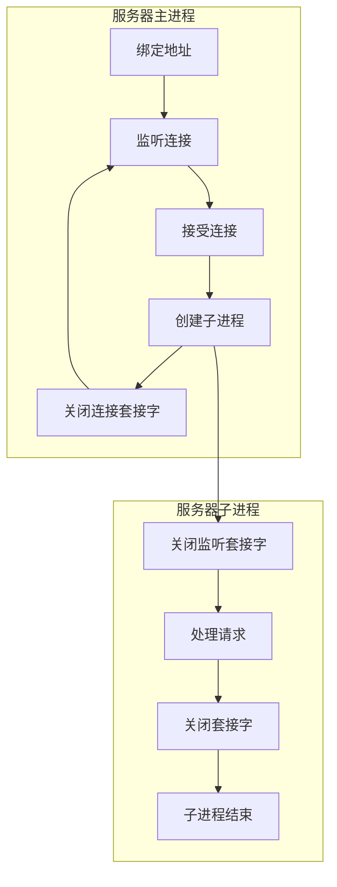

<div class="cover" style="page-break-after:always;font-family:方正公文仿宋;width:100%;height:100%;border:none;margin: 0 auto;text-align:center;">
    <div style="width:60%;margin: 0 auto;height:0;padding-bottom:10%;">
        </br>
        
    </div>
    </br></br></br></br></br>
    <div style="width:60%;margin: 0 auto;height:0;padding-bottom:40%;">
        
	</div>
		</br></br></br>
    <span style="font-family:华文黑体Bold;text-align:center;font-size:20pt;margin: 10pt auto;line-height:30pt;">《基于Select函数的并行文件服务器实现》</span>
    <p style="text-align:center;font-size:14pt;margin: 0 auto">实验报告 </p>
    </br>
    </br>
    <table style="border:none;text-align:center;width:72%;font-family:仿宋;font-size:14px; margin: 0 auto;">
    <tbody style="font-family:方正公文仿宋;font-size:12pt;">
    	<tr style="font-weight:normal;"> 
    		<td style="width:20%;text-align:right;">题　　目</td>
    		<td style="width:2%">：</td> 
    		<td style="width:40%;font-weight:normal;border-bottom: 1px solid;text-align:center;font-family:华文仿宋"> Linux第四次实验报告</td>     </tr>
    	<tr style="font-weight:normal;"> 
    		<td style="width:20%;text-align:right;">授课教师</td>
    		<td style="width:2%">：</td> 
    		<td style="width:40%;font-weight:normal;border-bottom: 1px solid;text-align:center;font-family:华文仿宋"></td>     </tr>
    	<tr style="font-weight:normal;"> 
    		<td style="width:20%;text-align:right;">姓　　名</td>
    		<td style="width:2%">：</td> 
    		<td style="width:40%;font-weight:normal;border-bottom: 1px solid;text-align:center;font-family:华文仿宋"> </td>     </tr>
        <tr style="font-weight:normal;"> 
    		<td style="width:20%;text-align:right;">班　　级</td>
    		<td style="width:2%">：</td> 
    		<td style="width:40%;font-weight:normal;border-bottom: 1px solid;text-align:center;font-family:华文仿宋"> </td>     </tr>
    	<tr style="font-weight:normal;"> 
    		<td style="width:20%;text-align:right;">学　　号</td>
    		<td style="width:2%">：</td> 
    		<td style="width:40%;font-weight:normal;border-bottom: 1px solid;text-align:center;font-family:华文仿宋"> </td>     </tr>
    	<tr style="font-weight:normal;"> 
    		<td style="width:20%;text-align:right;">日　　期</td>
    		<td style="width:2%">：</td> 
    		<td style="width:40%;font-weight:normal;border-bottom: 1px solid;text-align:center;font-family:华文仿宋">2022-6-21</td>     </tr>
    </tbody>              
    </table>
</div>


<!-- 注释语句：导出PDF时会在这里分页 -->

# Linux实验报告

## 实验目的 

基于Linux中并行机制的应用开发，掌握有关并行机制和服务器函数的使用方法，并通过并行机制改善服务器性能。

## 实验内容

（1）实现文件服务器的上传，下载功能。

（2）利用Select()函数实现服务器处理请求的并行。


## 实验步骤

### 基础概念

`Select函数`

`Select()`可以实现I/O端口的复用，函数使用的总体思路如下：

1. 首先我们需要将我们所关心的文件标识符（Linux下一切皆文件，每一个socket建立都会返回一个文件标识符，即一个整数）加入到select函数监测的队列（代码中指fdset）中
2. 一旦这些文件描述符所代表的事件有读、写或异常请求，select函数会返回一个大于0的整数，此时配合使用FD_ISSET(int fd, fd_set *fd_set)函数来判断fd是否有新事件到来。
3. 一旦某个文件描述符fd发生可读事件，FD_ISSET函数会返回1，此时我们可以通过if（）条件判断语句进行相应的操作。

```c++
/* According to POSIX.1-2001 */
#include <sys/select.h>
/* According to earlier standards */
#include <sys/time.h>
#include <sys/types.h>
#include <unistd.h>

int select(int nfds, fd_set *readfds, fd_set *writefds,
    fd_set *exceptfds, struct timeval *timeout);
```

1. `nfds`：取值为所监控的最大的文件描述符的数值 + 1（最大为1024），可以提高`select`的监控效率
2. `fd_set` ：是一个结构体，在结构体内部是一个`fds_bits`数组，他的使用可以看成是一个位图，一共1024位，对应着1024个文件描述符

### 任务分析

使用并发服务器的设计思想，实现一个功能类似于数据库的文件服务器。该文件服务器支持对文件的保存，实现客户端与服务器交互的三大功能。

(1)实现客户端查看服务器的目录的所有文件名。

(2)实现客户端可以下载服务器的目录的文件。

(3)实现客户端能够上传文件到服务器。

### 设计程序流程 



### 程序分析

使用Select的优点和缺点：

优点：

1. select 遵循的是posix标准，可以跨平台操作
2. select 对于超时的时间可以控制在微秒中

缺点：

1. select 是轮询遍历的，监控的效率会随着文件描述符的增多而下降
2. select 可以监控的文件描述符是有上限的（1024），取决于内核中__FD_SETSIZE宏的值
   select 在监控文件描述符的时候，需要将集合拷贝到内核当中；当监控的文件描述符就绪的时候，同样会从内核拷贝到用户空间中，他的效率会受到影响
3. select 在返回就绪的文件描述符的时候，会把集合中没有就绪的文件描述符删除掉，导致第二次在监控的时候还需要重新添加
4. select 无法直接查看那个文件描述符已经就绪，需要手动通过返回事件的集合去判断
5. select 的超时机制，如果在循环判断的情况下，每次调用之前都需要更新一下时间。因为在计时的时候，这个结构体中的时间是会变的

### 程序调试

先启动服务器程序。传递端口号，设置为8080，再启动客户端器程序，同样设置端口为8080

## 实验总结


服务器按处理方式可以分为迭代服务器和并发服务器两类。平常用C写的简单Socket客户端服务器通信，服务器每次只能处理一个客户的请求，它实现简单但效率很低，通常这种服务器被称为迭代服务器。 然而在实际应用中，不可能让一个服务器长时间地为一个客户服务，而需要其具有同时处理 多个客户请求的能力，这种同时可以处理多个客户请求的服务器称为并发服务器，其效率很 高却实现复杂。在实际应用中，并发服务器应用的最广泛。 

在本次实验，在Linux环境下，使用socket编程，通过I/O端口的复用（select函数）实现了基于TCP协议的并发服务器，所谓并发，即可以同时处理数个客户端的连接请求或已建立连接的数据收发服务。

## 附录

### 服务端

接受连接请求，建立连接，做出回应

```c++
#include <stdio.h>
#include <stdlib.h>
#include <string.h>
#include <unistd.h>
#include <sys/types.h>         
#include <sys/socket.h>
#include <time.h>
#include <sys/socket.h>
#include <netinet/in.h>
#include <netinet/ip.h>
#include <arpa/inet.h>
#include <sys/stat.h>
#include <fcntl.h>
#include <pthread.h>

int main()
{
    int sockListen, sockConn, index;
    int selectfd, client[5];
    int i, maxfd, clientid;
    fd_set fdset;
    char sendbuf[200];
    char recvbuf[200];
    int DataNum;
    struct sockaddr_in addrSrv;
    struct sockaddr_in addrClient;
    struct timeval timeout = { 0, 1 }; // 分别是秒和毫秒

    //创建一个服务器端socket
    if ((sockListen = socket(AF_INET, SOCK_STREAM, 0)) < 0)
    {
        perror("socket() failed ");
        exit(EXIT_FAILURE);
    }
    printf("sockListen:%d\n", sockListen);
    memset(&addrSrv, 0, sizeof(addrSrv));
    addrSrv.sin_addr.s_addr = inet_addr("192.168.***.***");
    addrSrv.sin_family = AF_INET;
    addrSrv.sin_port = htons(****);

    int opt = 1;
    if (setsockopt(sockListen, SOL_SOCKET, SO_REUSEADDR, &opt, sizeof(opt)) != 0)//防止地址占用
    {
        perror("Server setsockopt failed");
        exit(EXIT_FAILURE);
    }
   
    if (bind(sockListen, (struct sockaddr*)&addrSrv, sizeof(addrSrv)) == -1)
    {
        perror(" bind failed ");
        exit(EXIT_FAILURE);
    }

    if (listen(sockListen, 5) == -1) //listen函数将连接的客户端放入队列，参数2为队列长度。
    {
        perror(" listen failed ");
        exit(EXIT_FAILURE);
    }
    printf("*Start listening \n*Waiting for client's request  \n");
    maxfd = sockListen;
    memset(client, -1, sizeof(client));

    while (1)
    {
        FD_ZERO(&fdset);
        FD_SET(sockListen, &fdset);
        for (i = 0; i < 5; i++)
        {
            if (client[i] > 0)
            {
                FD_SET(client[i], &fdset);
            }
        }

        selectfd = select(maxfd + 1, &fdset, NULL, NULL, NULL);//
        if (selectfd == 0)
        {
            printf("timeout");
            exit(EXIT_FAILURE);
        }
        if (selectfd < 0)
        {
            perror("select");
            exit(EXIT_FAILURE);
        }
        if (selectfd > 0)
        {
            for (index = 3; index <= maxfd + 1; index++)//i++
            {
                if (!FD_ISSET(index, &fdset))
                {
                    continue;
                }
                if (index == sockListen)
                {
                    socklen_t len = sizeof(addrClient);
                    memset(&addrClient, 0, sizeof(addrClient));
                    if ((sockConn = accept(sockListen, (struct sockaddr*)&addrClient, &len)) < 0)//"maxfd+1"
                    {
                        perror("accept");
                    }
                    else
                    {
                        printf("new socket fd:%d\n", sockConn);
                        for (i = 0; i < 5; i++)
                        {
                            if (client[i] < 0)
                            {
                                client[i] = sockConn;
                                break;
                            }
                        }
                        if (sockConn > maxfd)
                        {
                            maxfd = sockConn;
                        }
                        printf("New connection accepted:Client%d\n", i + 1);
                        printf("the connected IP: %s,the port :%d\n", inet_ntoa(addrClient.sin_addr), htons(addrClient.sin_port));
                        break;
                    }
                }
                else
                {
                    for (i = 0; i < 5; i++)
                    {
                        if (client[i] == index)
                        {
                            clientid = i;
                            break;
                        }
                    }
                    DataNum = recv(index, recvbuf, 200, 0);
                    if (DataNum == 0)
                    {
                        close(index);
                        FD_CLR(index, &fdset);
                        client[clientid] = -1;
                        printf("client%d closed!\n", clientid + 1);
                        continue;
                    }
               
                    if (strcmp(recvbuf, "quit") == 0)
                    {
                        close(index);
                        FD_CLR(index, &fdset);
                        client[clientid] = -1;

                    }
                    printf("RECV--Client%d:the nummber :%d,the content:%s\n", clientid + 1, DataNum, recvbuf);
                    memset(recvbuf, 0, strlen(recvbuf));//clear
                    break;
                }
            }
        }
    }

    close(sockConn);
    close(sockListen);

}
```

### 服务端

1. 发起建立连接请求
2. 发送数据
3. 最后进行功能验证时可以同时启用多个客户端同时进行连接或数据发送代码片.

```c++
#include <stdio.h>
#include <stdlib.h>
#include <string.h>
#include <unistd.h>
#include <sys/types.h>         
#include <sys/socket.h>
#include <time.h>
#include <sys/socket.h>
#include <netinet/in.h>
#include <netinet/ip.h> 
#include <arpa/inet.h>
#include <sys/stat.h>
#include <fcntl.h>

int main()
{
    int sockclt;
    char sendbuf[200];
    char recvbuf[200];
    int DataNum;
    struct sockaddr_in addrSrv;
    memset(&addrSrv, 0, sizeof(addrSrv));//clear addrsrv
    addrSrv.sin_addr.s_addr = inet_addr("192.168.***.***");
    addrSrv.sin_family = AF_INET;
    addrSrv.sin_port = htons(***);

    if ((sockclt = socket(AF_INET, SOCK_STREAM, 0)) == -1)
    {
        perror("socket failed");
        exit(EXIT_FAILURE);
    }
   
    if ((connect(sockclt, (struct sockaddr*)&addrSrv, sizeof(addrSrv))) == -1)
        {
            perror("connection failed");
        }

    printf("Connected!\n");
    //send
    while (1)
    {
        printf("input your message:");
        scanf("%s", sendbuf);
        //printf("the message is %s \n",sendbuf);
        if (strcmp(sendbuf, "quit") == 0)
        {
            break;
        }
        DataNum = send(sockclt, sendbuf, strlen(sendbuf), 0);
        printf("the nummber you sent is %d\n", DataNum);
        if (DataNum < 0)
        {
            perror("send failed");
            exit(EXIT_FAILURE);
        }
    }
    printf("send stoped!");
    close(sockclt);
}
```

