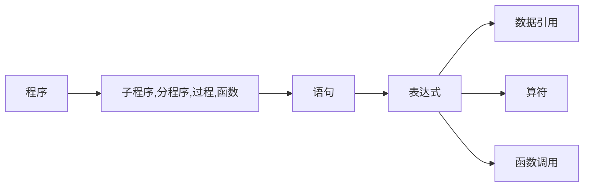
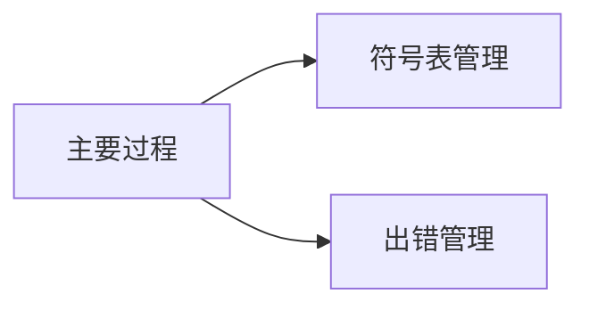
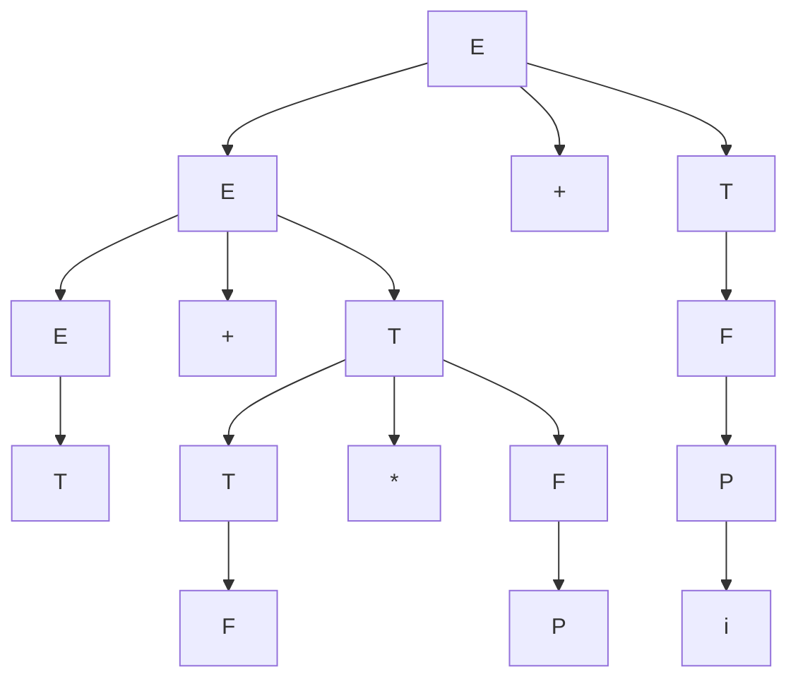

感谢Bilibili University的 [致爱意](https://space.bilibili.com/514480242)，语法分析部分她的讲解视频提供了很大的帮助

-----

[TOC]

- 绪论
- 形式语言概论
- 词法分析
- 语法分析
- 语义分析及中间代码生成
- 代码优化
- 符号表

## 绪论

### 编译程序的概念

程序：一系列指令或语句，用来描述计算机依次要执行的一系列工作。本质上是描述一定数据的处理过程

程序的层次结构：

结构：基本符号（字母，数组，符号等）、单词、表达式、语句、分程序、程序

程序设计语言：所有该语言的程序的全体

- 语法、语义、语用
- 语法：表示构成语言句子的各个记号之间的**组合规律**
  是描述程序的结构，根据它可以产生正确的程序（词法规则，语法规则）。
  语法规则和词法规则定义了程序的形式结构，定义语法单位的意义属于语义问题。
  - 词法规则：单词符号的形成规则（单词符号是语言中具有独立意义的最基本结构）
    - 包括：常数、标识符、基本字、算符、界符（逗号、分号、括号、空白）
    - 描述工具：有限自动机
  - 语法规则：语法单位的形成规则
    - 包括：表达式、语句、分程序、过程、函数、程序
    - 描述工具：上下文无关文法
- 语义：表示按照各种表示方法所表示的各个记号的特定**含义**
  是语言成分的含义，由程序执行的效果来说明。各个记号和记号所表示的对象之间的关系。
- 语用：表示在各个记号所出现的行为中，它们的**来源、使用和影响**

编译程序：将程序翻译成汇编语言程序或机器语言程序（目标程序），然后再执行的翻译程序

### 编译过程

主要过程：

语法分析之后产生语法单位；目标代码之前都是四元式

词法分析：从左至右读取字符流的源程序，识别单词并表示成机内表示

语法分析：依据源程序的语法规则把源程序的单词序列组成语法短语

语义分析：分析由语法分析器给出的语法单位的语义

中间代码生成：源程序的内部表示（三元式、四元式、逆波兰表达式）

代码优化：对代码进行等价变换提高执行效率[运行速度、节省存储空间]（机器有关、机器无关）

目标代码生成

符号表管理：每一步都会用到

前端：词法、语法、语义、中间代码生成，与机器无关的代码优化

后端：与机器有关的代码优化、目标代码生成

便于程序移植

### 遍

对源程序或源程序的中间表示从头到尾扫描一次

- 一遍可以由若干段组成
- 一个阶段也可以分若干遍来完成

## 文法和语言

形式语言：只在语法意义下的语言

字母表$\sum$：元素的非空有穷集合

符号：字母表中的元素

文法：描述语言的语法结构的形式规则或语法规则
作用：用有穷集合表示无穷句子
文法四元组：$G(V_N,V_T,P,S)$，简记为$G[S]$

V => W: V直接推导出W，W直接规约为V

句型 = $\{x|S \stackrel{*}{\Rightarrow} x ,\ 且\ x\in V^* \}$，==识别符号S也是句型==

句子 = $x, (S \stackrel{+}{\Rightarrow} x ,\ 且\ x\in V_T^* )$，$x$仅由终结符号组成,==句子也是句型==

语言  $L(G) = \{x|S \stackrel{+}{\Rightarrow} x ,\ 且\ x\in V_T^* \}$，文法G的一切句子的集合

文法的等价：$L(G_1) = L(G_2)$

文法的类型：对任一产生式$\alpha \rightarrow \beta$,

1. 0型文法: $\alpha \in (V_N \cup V_T)^+,\ \ \beta \in (V_N \cup V_T)^*$
2. 1型文法(上下文相关): $|\beta| \ge |\alpha|, \ \ S \rightarrow \epsilon除外$
3. 2型文法(上下文无关): $\alpha \in V_N,\ \ \beta \in (V_N \cup V_T)^*$ 
4. 3型文法(正则): 形式都为$A \rightarrow aB 或\ A \rightarrow a,\ A \in V_N, B\in V_N, a\in V_T$

上下文相关: $\alpha_1A\alpha_2 \rightarrow \alpha_1\beta\alpha_2$, $A\in V_N, 其他是V^*, \beta \ne \epsilon$

上下文无关: $A \rightarrow \beta$, $A \in V_N, \beta \in V^*$

### 语法树

最左推导：任何一步 $\alpha \Rightarrow \beta$ 都是对 $\alpha$ 中的最**左**非终结符进行替换
最右推导：任何一步 $\alpha \Rightarrow \beta$ 都是对 $\alpha$ 中的最**右**非终结符进行替换
最右推到被称为规范推导。规范推导得到的句型称为规范句型

文法二义性：一个文法存在某个句子对应两棵不同的语法树（最左最右推导的语法书不一样）

短语：内部节点的叶子结点

直接短语：直接长成的叶子结点

素短语：短语中，(1)至少含有一个终结符 (2)不含其它更小的素短语

句柄：最左最小的树对应的符号串。直接短语中最左

🌰1

🌰2

## 词法分析

### 基础概念

单词符号的种类：基本字、标识符、常数、运算符、界符（逗号、分号、括号、空白）

正规式和正规集：
正规集可以用正规表达式（正规式）表示
正规式是表示正规集的一种方法
一个字的集合是正规集当且仅当它能用正规式表示
$\epsilon$ 和 $\phi$ 都是 $\sum$ 上的正规式，它们所表示的正规集为 $\{\epsilon\}$ 和 $\phi$ 

正规集为程序的单词集合

正规式为词法规则

确定有限自动机（DFA）

自动机**五元式** $M = (S, \sum, f, S_0, F)$

$S$：有穷状态集

$\sum$：输入字母表

$f$：状态转换函数（单值映射）

$S_0$：唯一初态

$F$：终态集（可空）

非确定有限自动机（NFA）五元式，区别是：

$f$：状态转换函数（非单值）

$S_0$：初态集

- 可有多个初态
- 弧上的标记可以是一个字甚至正规式
- 同一个字可能出现在同状态射出的多条弧上

结论：判定两个自动机等价性的算法是存在的

### NFA转换为等价的DFA（确定化）

1. 引进新的初态节点X和终态节点Y，从X向初态集中任意节点引一条$\epsilon$弧，从终态集中每一结点引一条$\epsilon$弧
2. 将状态转换图转变为每条弧只标记为$\sum$上的一个字符或$\epsilon$
3. 构造表

DFA最少化的基本思想：

把M的状态集划分成一些不想交的自己，使得任何两个不同子集的状态是可区别的（不等价的），而同一子集的任何两个状态是等价的

## 语法分析——自上而下分析

### 左递归 & 回溯

关键问题：

- 消除左递归
- 消除回溯

### First & Follow

#### 定义

$G = (V_T,V_N,S,P)$是上下文无关文法

$First(\alpha) = \{a | \alpha \stackrel{*}{\Rightarrow} a\beta, a\in V_T, \alpha,\beta \in V^* \}$, 若 $\alpha \stackrel{*}{\Rightarrow} \epsilon$，则规定 $\epsilon \in First(\alpha)$

- 第一个终结符

$Follow = {a | S \stackrel{*}{\Rightarrow} \mu A\beta, a \in First(\beta), \mu \in V^*, \beta \in V^+ }$

- $\beta$ 串的第一个终结符
- 含义：文法符号后面可能跟随的终结符集合，不包含 $\epsilon$
- 目的：若推出$\epsilon$，后面跟什么串

#### 求法

==First集看产生式左部，Follow集看产生式右部==

First：

- 若右部第一个是终结符，则加入集合
- 若右部第一个是非终结符，则将其First集加入集合

Follow：（针对B）

- 文法开始符，必有#
- 情况一(后面没东西)：A -> $\alpha B$ FOLLOW(B) B后为空，则将FOLLOW(A)加入到FOLLOW(B)中
- 情况二(后面有东西)：A -> $\alpha B\beta$ 
  - $\beta$ 是终结符，直接写下来
  - $\beta$ 是非终结符，first($\beta$) ==除去$\epsilon$== 加入到follow(B)
  - 如果 $\beta \rightarrow \epsilon$ ，则转回情况一

🌰1:

例子2:

### LL(1)

#### 含义：

1. 第一个L：自顶向下分析是**从左向右扫描**输入串
2. 第二个L：分析过程中使用**最左推导**
3. 1: 只需**向右看一个符号**便可决定如何推导（选择哪个产生式进行推导）

类似LL(K)，向前查看K个符号

#### Select

分析条件（判断一个文法是LL(1)文法）：

1. 文法不含左递归
2. 对于文法中每一个非终结符$A$的任意两产生式$\alpha_i$ 和 $\alpha_j$，即这种情况：$A \rightarrow \alpha_i | \alpha_j$
   1. 若候选首符集不包含 $\epsilon$ : $First(\alpha_i) \cap First(\alpha_j) = \phi$
   2. 若它存在某个候选首符集包含 $\epsilon$, 则 $First(A) \cap Follow(A) = \phi$

引出Select集：$A \rightarrow \alpha, A\in V_N, \alpha \in V^*$

1. $\alpha \stackrel{*}\Rightarrow \epsilon$ : $Select(A\rightarrow \alpha) = (First(\alpha)-\epsilon) \cup Follow(A)$
2. $\alpha \stackrel{*}\nRightarrow \epsilon$ : $Select(A\rightarrow \alpha) = First(\alpha)$

所以LL(1)文法的满足条件是：

对于每个非终结符 A 的任意两条产生式，都满足 ==$Select(A\rightarrow \alpha) \cup Select(A\rightarrow \beta) = \phi$==

#### 预测分析表 $M$ 的构造方法

1. 对文法 $G$ 的每个产生式 $A \rightarrow \alpha$ 执行2，3 【根据产生式构造分析表】
2. 对每个终结符 $a \in First(\alpha)$，把 $A \rightarrow \alpha$ 加至 $M[A,a]$
3. 若 $\epsilon \in First(\alpha)$，即能推出空串，则对任何 $b\in Follow(A)$ 把 $A \rightarrow \alpha$ 加至 $M[A,b]$
4. 把所有无定义的 $M[A,a]$ 标上“出错标志”

例子：
构造时，看First集，找对应的产生式写在对应的位置；如果有\epsilon，则看Follow集，将产生式写在对应位置

## 语法分析——自下而上分析

基本思想：从输入串开始，逐步进行“规约”，直到文法的开始符号。即从树末端开始，构造语法树。

规约：根据文法的产生式规则，把产生式的右部替换为左部符号。“移进-规约”思想

关键问题：精确定义“可规约串”这个直观概念

- 算符优先分析 —— 最左素短语
- 规范规约 —— 句柄

### 规范规约

$G$是文法，$S$是开始符号，$\alpha \beta \delta$ 是文法的一个句型，

如果有：$ S \stackrel{*}{\Rightarrow} \alpha A \delta$ , $A \stackrel{+}{\Rightarrow} \beta$, 则 $\beta$ 是句型 $\alpha \beta \delta$ 相对于非终结符A的==短语==

特别是如果有：$A \Rightarrow \beta$, 则 $\beta$ 是句型 $\alpha \beta \delta$ 相对于规则 $A \rightarrow \beta$ 的直接短语

一个句型的最左直接短语称为该句型的==句柄==(唯一性)。**对于规范句型来说，句柄的后面只能出现终结符。**

利用句柄作为“可规约串”进行的规约过程为规范规约，也称最左规约，因为形式语言中最右推导常被称为规范推导，若文法是无二义的，则规范推导的逆过程必是规范规约

在一个句型对应的语法树中：

- 以某非终结符为根的**两代以上的子树的所有末端结点从左到右排列**就是相对于该非终结符的一个**短语**
- 如果**子树只有两代**，则该短语就是**直接短语**

==素短语==：一个文法G的句型的素短语是指至少含有一个终结符，并且除它自身以外不再含任何更小的素短语

==最左素短语==：处于句型最左边的素短语

==🌰==：文法G(E):
(1) E -> E+T | T
(2) T -> T*F | F
(3) F -> P$\uparrow$F | F
(4) P -> (E) | i

对于句型： T+F*P+i

短语：T, F, P, i, F\*P, T+F\*P, T+F*P+i (两代以上子树的叶子结点)

直接短语：T, F, P, i (两代子树的叶子结点)

句柄：T (最左直接短语)

素短语：F*P, i (最深短语)

最左素短语：F*P

### 简单优先分析

#### 优先关系表

- $a \doteq b$：对形如 P -> …ab… 或 P -> …aQb… 的产生式
- $a \lessdot b$：对形如 P -> …aP…，有 $b \in Firstvt(P)$
- $a \gtrdot b$：对形如 P -> …Pa…，有 $a \in Lastvt(P)$

FirstVT：第一个终结符

LastVT：最后一个终结符

#### 基本概念

算符优先分析法不是一种规范规约法

算符文法：如果它的任一产生式的右部都不含两个相继（并列）的非终结符，即不含形如 …QR… 形式的产生式右部 

#### 构造优先关系表的算法

根据表达式：

1. 先找出所有 $a\doteq b$ 的终结符对。
2. 构造Fitstvt和Lastvt集合
   1. 若有产生式 P -> a… 或 P -> Qa…，则 $a \in Firstvt(P)$
   2. 若 $a \in Firstvt(Q)$, 且有产生式 P -> Q… 则 $a \in Firstvt(P)$
   3. 若有产生式 p -> …a 或 P -> …aQ，则$a \in Lastvt(P)$
   4. 若 $a \in Lastvt(Q)$, 且有产生式 P -> …Q 则 $a \in Lastvt(P)$
3. 检查每个产生式的候选关系确定满足 $\lessdot$ 和 $\gtrdot$ 的所有终结符对（已知永远小于未知）

例子

### 算符优先分析法（OPG）

算符优先文法句型：$N_1a_1N_2a_2...N_na_nN_{n+1}$，其中每个 $a_i$ 都是终结符，$N_i$ 是可有可无的非终结符

一个算符优先文法G的任何句型的最左素短语是满足如下条件的最左子串：
$$
N_j a_j N_{j+1} a_{j+1}...N_i a_i N_{i+1},\ 其中 a_{j-1} \lessdot a_j,\  a_j \doteq a_{j+1},...,\ a_{i-1} \doteq a_i,\ a_i \gtrdot a_{i+1}
$$

算符优先分析算法：

维护一个算符哟选关系单调不减的的栈，若栈顶的第一个终结符 $\gtrdot$ 当前面对的输入串字符，则弹出一段具有 $\doteq$  关系的栈中串。利用某一产生式进行规约，此产生式的右部从左至右和弹出串从下至上一一对应，终结符对终结符，非终结符对非终结符（仅要求对应的终结符相同）

算法完成工作时，符号栈S应呈现 `#N#` ，N是一个非终结符，但其不一定是开始符号

算符优先分析比规范规约要快得多，因为跳过了所有单非产生式（形如 P->Q）

算符优先分析法的关键问题是 —— 寻找最左素短语

### LR分析法

定义：是一种自底向上进行规范规约的语法分析方法

实质：是一个带先进后出存储器（栈）的确定有限状态自动机

L：从左到右扫描输入串
R：构造一个最右推导的逆过程

四个操作动作：移进、规约、接受、报错

把“历史”和“展望”抽象成了**状态**，再结合当前输入符号的**现实**信息，即可完成LR分析

LR文法：

- LR文法：能够构造一张分析表，它的每个入口都是唯一确定的
  LR(K)文法：能用一个每步顶多向前检查K个输入符号的LR分析器进行分析

- 并非所有上下文无关文法都是LR文法

- LR文法不是二义的，二义文法肯定不会是LR的

字的前缀：字的首部，包括空串 $\epsilon$

活前缀：规范句型的一个前缀，这种前缀不含句柄之后的任何符号（这些符号必为终结符串）
规范规约过程中，保证分析栈中总是活前缀，就说明分析采取的移进/规约动作是正确的

项目：G的文法G的每个产生式的右部添加一个圆点称为G的LR(0)的项目

$A \rightarrow \epsilon$ 只对应一个项目：$A \rightarrow \ \cdotp $

文法的LR(0)项目规范族：构成识别一个文法活前缀的DFA项目集的全体

规约项目（==$\cdotp$ 在最后==）：$A \rightarrow \alpha \cdotp$ 
接受项目（==开始文法对应的==）：$S' \rightarrow \alpha \cdotp$
移进项目（==$\cdotp$后面是终结符==）：$A \rightarrow \alpha \cdotp a\beta, (a \in V_T)$
待约项目（==$\cdotp$后面是非终结符==）：$A \rightarrow \alpha \cdotp B\beta, (B \in V_N)$

有效项目：任何时候，分析栈中的活前缀 $x_1 x_2 ... x_m$ 的有效项目集正是栈顶状态 $S_m$ 所代表的那个集合

#### LR(0)项目集规范族的构造

1. 改造文法，引入唯一的“接收态”产生式 S’ -> S

2. 计算 Closure(I) 和 Go(I,X)

   Go(I,x) = Closure(J)，其中 J = {任何形如A->$\alpha x\cdotp \beta$ | A->$\alpha \cdotp x\beta$ 属于I}

   直观上说，若 I 是对某个活前缀 $\gamma$ 有效项目集，那么Go(I,x)便是对 $\gamma x$ 有效的项目集

3. 以 {Closure({S’->S})} 为状态0，利用Go函数吧项目集连成一个DFA转换图
4. 按照以下规则构造 Action 子表和 Goto 子表
   1. 若项目 $A$->$\alpha \cdotp \beta$ 属于 $I_k$ 且 $Go(I_k,a)=I_j$, $a$为终结符，则 $Action[k,a]=S_j$
   2. 若项目 $A \rightarrow \alpha \cdotp$ 属于 $I_k$ ，那么对于任何终结符 $a$（或结束符 # ），$Action[k,a] = \gamma_j$
   3. 若项目 $S’ \rightarrow S\cdotp$ 属于 $I_k$， $Action[k,\#] = acc$
   4. 若 Go(I_k,A) = I_j, A为非终结符，则 Goto[k,A] = j
   5. 空白格为出错标志。

#### SLR分析表的构造

假定LR(0)规范族的一个项目集 I 中含有 m 个一进项目，同时含有 n 个规约项目，如果所有规约项目左部的非终结符的Follow集两两不相交（包括不得有两个Follow集合有#），且不与任何移进项目接受的终结符 a 相交，则隐含在I中的动作冲突可通过检查现行输入符号a属于上述n+1个集合中的哪个集合而获得解决

1. 若 $a \in \{a_1, a_2, ..., a_m\}$则移进
2. 若 $a \in Follow(B_i), i=1,2,...,n$，则用产生式$B_i \rightarrow \alpha$进行规约
3. 此外，报错

SLR(1)解决办法：冲突性动作的这种解决办法

构造分析表与构造LR(0)分析表仅在第(2)步有所不同，只将属于Follow(A)的终结符写入$\gamma_j$

#### 规范LR分析表的构造

每个项目的一般形式是$[A \rightarrow \alpha\cdotp \beta, a_1a_2...a_k]$这样的一个项目称为一个LR(K)项目，项目中的 a1…ak称为向前搜索串/展望串

向前搜索串仅对规约项目有意义，即需要分裂LR(0)中的项目

#### LR(1)的Closure集和Go函数

Closure(I):

1. I的任何项目都属于Closure(I)
2. 若项目$[A\rightarrow \alpha \cdotp B\beta,a]$属于Closure(I)，$B \rightarrow \epsilon$是一个产生式，那么对于$First(\beta a)$中的每个终结符b，如果$[B\rightarrow \cdotp \epsilon, b]$原来不在Closure(I)中，则把它加进去

转换函数Go：

1. 令I是一个项目集，X是一个文法符号，函数Go(I,x)定义为：$Go(I,x) = Closure(J)$

   其中 $J = \{ 任何形如[A \rightarrow \alpha X\cdotp \beta, a]的项目 | [A \rightarrow \alpha \cdotp X \beta, a] \in I\}$

#### LR(1)分析表的构造(带向前搜索符的项目集规范族)

基本思想与构造LR(0)分析表相同，具体：

1. 含 [S’ -> S, #]的集合为分析器的初态
2. 记规约是仅记展望串中的终结符列

三种规范规约关系：

LR(1)状态比SLR多

$LR(0) \subset SLR \subset LR(1) \subset 无二义文法$

### 区别

## 属性文法和语法制导翻译

### 属性文法

上下文无关文法的基础上，为每个文法符号（终结符/非终结符）配备若干相关的“值”（称为属性）

- 属性代表与文法符号相关信息，如类型值、代码序列、符号表内容等
- 属性可以进行计算或传递
- 语义规则：对于文法的每个产生式都配备了一组属性的计算规则

属性

- 综合属性：“自下而上”传递信息
- 继承属性：“自上而下”传递信息

终结符只有综合属性，由词法分析器提供

非终结符既可有综合属性也可有继承属性，文法开始符号的所有继承属性为属性计算前的初始值

对出现在产生式右边的继承属性和出现在产生式左边的综合属性都必须提供一个计算规则。
属性计算规则中只能使用相应产生式中的文法符号的属性

出现在产生式左边的继承属性和出现在产生式右边的综合属性不由所给的产生式的属性计算规则进行计算，它们由其它产生式的属性规则计算或者由属性计算器的参数提供

语义规则所描述的工作可以包括：属性计算、静态语义检查、符号表操作、代码生成等

在语法树中，一个结点的综合属性的值由其子结点和它本身的属性值确定

一个结点的继承属性由此结点的父节点（或兄弟结点）和其本身的某些属性确定

### 基于属性文法的处理方法

依赖图：

每一个包含过程调用的语义规则引入一个虚综合属性

依赖图中如果属性b依赖于属性c，则从属性c的结点有一条有向边连到属性b的结点

良定义的属性文法：如果一属性文法不存在属性之间的循环依赖，则称该文法为良定义的

